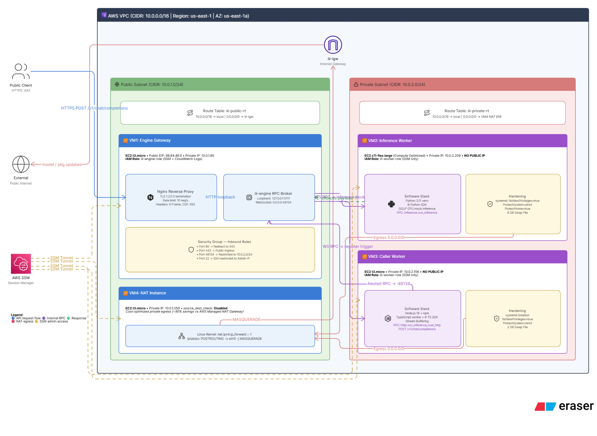
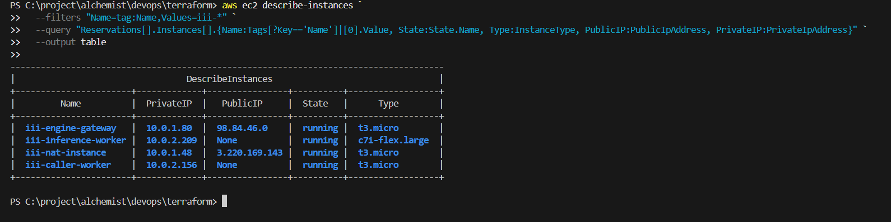
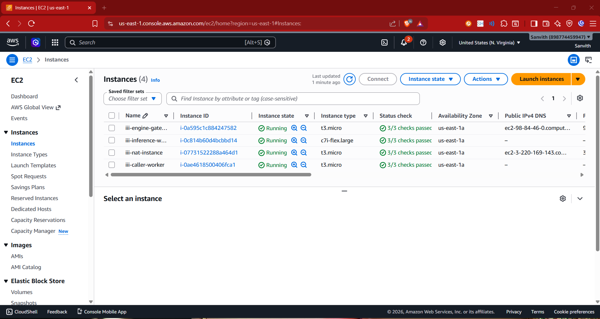
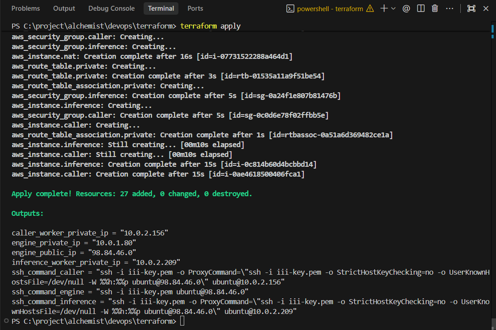
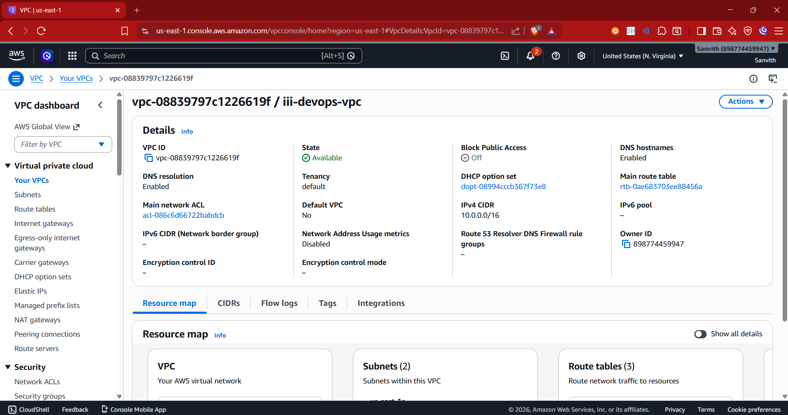
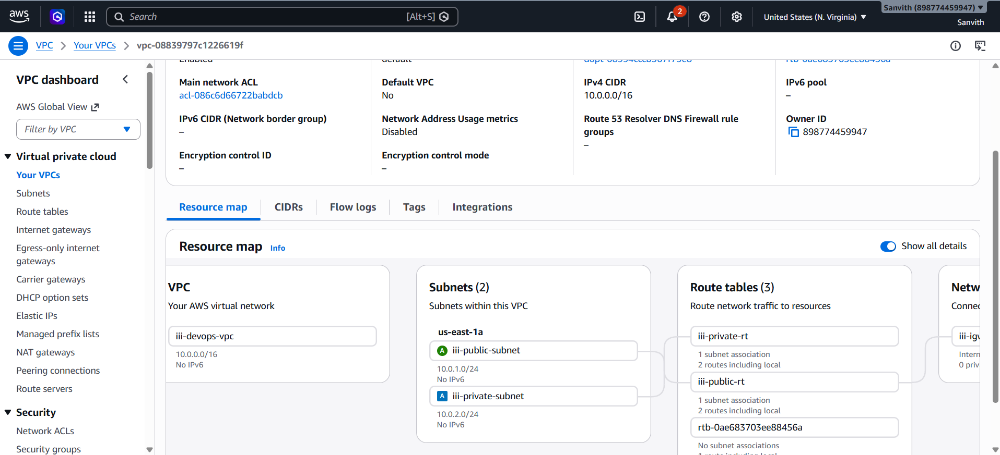
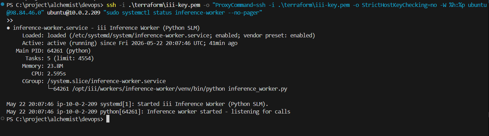
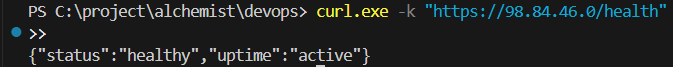
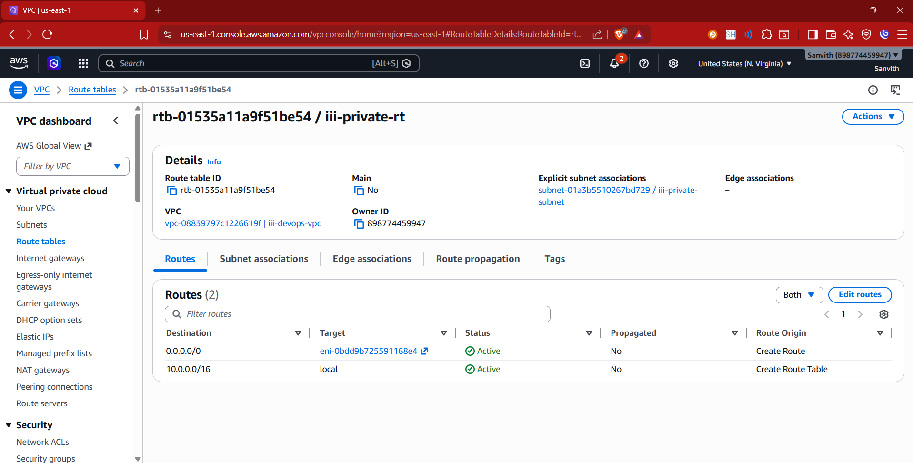

# 🤖 Distributed AI Inference Platform on AWS

### Terraform · Ansible · Nginx · iii-Engine · WebSocket RPC · Private Subnet Architecture

[](https://www.terraform.io/)
[](https://aws.amazon.com/)
[](https://www.ansible.com/)
[](https://python.org/)
[](https://www.typescriptlang.org/)
[](https://nginx.org/)
[](https://opensource.org/licenses/MIT)

> [!TIP]
> ### 🌟 Interactive Portfolio Showcase
> **Experience a visual, interactive simulation of this entire infrastructure!**
>
> Open **[`SHOWCASE.html`](./SHOWCASE.html)** in any web browser to explore:
> - 🌐 **Interactive System Architecture Topology Map** with packet-flow visualizers
> - ⚡ **Interactive API Completions Simulator** showing complete trace logs
> - 📟 **Mock Shell Terminal** with diagnostic command executions
> - 📂 **Technical Blueprint Explorer** for all HCL, Ansible YAML, and systemd units
> - 🩺 **Real-Time Debugging Journal** documenting real incident investigations

---

## 📋 Overview

This project implements a **fully automated, production-grade distributed AI inference system** deployed across multiple isolated AWS EC2 instances. It combines Infrastructure-as-Code (Terraform), configuration management (Ansible), and a WebSocket-based RPC mesh (iii-engine) to expose a private, multi-worker AI inference pipeline through a public HTTPS API.

Workers written in **Python** and **TypeScript** run exclusively inside a **private subnet** — completely isolated from the internet — and communicate with the central engine via outbound WebSocket connections. A self-signed TLS-terminated **Nginx reverse proxy** sits at the public edge, rate-limiting and forwarding HTTP requests into the internal inference mesh.

> **Key achievement:** A client can call `POST /v1/chat/completions` over HTTPS, which travels through Nginx → iii-engine → TypeScript caller-worker → Python inference-worker — all dynamically routed via WebSocket RPC — returning an OpenAI-style JSON response.

---

## ✨ Key Features

| Feature | Detail |
|---|---|
| 🏗️ **Infrastructure as Code** | 100% Terraform — VPC, subnets, EC2, IAM, SGs, NAT, routing |
| 🤖 **Ansible Automation** | Full configuration management — packages, systemd, code deployment |
| 🔒 **Private Subnet Isolation** | Workers have **no public IPs** and are unreachable from the internet |
| 🌐 **NAT Instance Routing** | Cost-optimized self-managed NAT (~$3.80/mo vs $32/mo managed) |
| 🔐 **HTTPS API Gateway** | TLS-terminated Nginx reverse proxy with security headers and rate limiting |
| 🔌 **WebSocket RPC Mesh** | Bidirectional outbound WS connections — workers register dynamically |
| 🧩 **Polyglot Workers** | Python inference worker + TypeScript caller worker communicating via RPC |
| 📦 **systemd Services** | All workers run as hardened systemd units with `Restart=on-failure` |
| 🩺 **Health Endpoints** | `/health` readiness check + `/v1/chat/completions` for inference validation |
| 🛡️ **SSM Integration** | AWS Systems Manager access on all VMs — no direct SSH port exposure required |
| 📊 **IAM Least Privilege** | Separate IAM roles for engine and workers with scoped policy attachments |
| ♻️ **Resiliency Built-In** | Exponential backoff reconnect loops + systemd auto-restart boundaries |

---

## 🏛️ Architecture



```
                 ┌──────────────────────────────────────────────────────────────────┐
                 │                    AWS VPC  (10.0.0.0/16)                        │
                 │                                                                  │
                 │  ┌──────────────────────────────────────────────────────────┐   │
                 │  │                 Public Subnet (10.0.1.0/24)               │   │
                 │  │                                                            │   │
  Internet ──►  │  │   ┌──────────────────────────────────┐  ┌──────────────┐  │   │
  HTTPS :443    │  │   │   VM1 — Engine & API Gateway     │  │ VM4 — NAT    │  │   │
                │  │   │   • Nginx (TLS, rate-limit)      │  │ • ip_forward │  │   │
                │  │   │   • iii-engine (:3111 local)     │  │ • iptables   │  │   │
                │  │   │   • WS listener (:49134)         │  │   MASQUERADE │  │   │
                │  │   │   • Elastic Public IP            │  └──────┬───────┘  │   │
                │  │   └────────────┬──────────┬──────────┘         │ outbound │   │
                │  └───────────────┼──────────┼────────────────────┼──────────┘   │
                │                  │ WS :49134│ WS :49134          │              │
                │  ┌───────────────┼──────────┼────────────────────┼──────────┐   │
                │  │         Private Subnet (10.0.2.0/24)           │          │   │
                │  │               │          │                     │          │   │
                │  │  ┌────────────┴───┐  ┌───┴────────────┐       │          │   │
                │  │  │ VM2            │  │ VM3             │       │          │   │
                │  │  │ inference-     │  │ caller-worker   │       │          │   │
                │  │  │ worker         │  │ (TypeScript)    │───────┘ outbound │   │
                │  │  │ (Python)       │  │                 │ via NAT          │   │
                │  │  │ No Public IP   │  │ No Public IP    │                  │   │
                │  │  └────────────────┘  └─────────────────┘                 │   │
                │  └──────────────────────────────────────────────────────────┘   │
                └──────────────────────────────────────────────────────────────────┘
```

### Request Flow

```
Client (HTTPS POST)
    │
    ▼
Nginx :443  ──── TLS termination + rate limit (10 req/s, burst 20)
    │
    ▼
iii-engine :3111  ──── HTTP trigger routing
    │
    ▼  (WebSocket RPC down to VM3)
caller-worker (TypeScript, VM3)  ──── request validation
    │
    ▼  (nested RPC call back through engine)
inference-worker (Python, VM2)  ──── SLM token generation
    │
    ▼  (response bubbles back up the chain)
Client  ◄──── JSON response {"choices": [...]}
```

---

## 🛠️ Tech Stack

| Layer | Technology | Role |
|---|---|---|
| **Cloud** | AWS EC2, VPC, IAM, SG | Infrastructure hosting |
| **IaC** | Terraform ≥ 1.5 | Reproducible provisioning |
| **Config Mgmt** | Ansible ≥ 2.15 | Software configuration & deployment |
| **API Gateway** | Nginx | TLS termination, rate limiting, reverse proxy |
| **RPC Engine** | iii-engine | WebSocket-based RPC coordination |
| **Worker (Inference)** | Python 3.11 | LLM inference via iii SDK |
| **Worker (Caller)** | TypeScript / Node.js | API trigger handler |
| **Service Mgmt** | systemd | Process supervision & auto-restart |
| **OS** | Ubuntu 22.04 LTS | All VMs |
| **Networking** | WebSockets (WS) | Worker-to-engine communication |
| **NAT** | Self-managed t3.nano | Private subnet outbound routing |

---

## 📁 Project Structure

```
devops/
│
├── terraform/                  # Infrastructure as Code
│   ├── main.tf                 # Provider configuration (AWS + dual-account)
│   ├── vpc.tf                  # VPC, subnets, IGW, route tables
│   ├── instances.tf            # EC2 instances (Engine, Caller, Inference)
│   ├── nat_instance.tf         # NAT instance + iptables bootstrap + AMI data
│   ├── security_groups.tf      # Per-VM security group rules
│   ├── iam.tf                  # IAM roles, policies, instance profiles
│   ├── key_pair.tf             # RSA 4096 key generation + local PEM file
│   ├── outputs.tf              # Public IPs, private IPs, SSH commands
│   └── variables.tf            # Configurable variables with sane defaults
│
├── ansible/                    # Configuration Management
│   ├── playbook.yml            # Master playbook — 4 plays, 5 roles
│   ├── generate_inventory.py   # Reads terraform output → builds inventory.ini
│   ├── ansible.cfg             # SSH settings, host key checking disabled
│   ├── inventory.ini           # Auto-generated by generate_inventory.py
│   └── roles/
│       ├── common/             # System packages, swap, user creation
│       ├── nginx/              # Nginx install, SSL cert gen, config deploy
│       ├── engine/             # iii-engine install, systemd service
│       ├── inference-worker/   # Python venv, iii SDK, systemd service
│       └── caller-worker/      # Node.js, npm install, systemd service
│
├── nginx/
│   └── iii-api.conf            # Nginx vhost — TLS, rate limit, proxy rules
│
├── systemd/
│   ├── iii-engine.service      # systemd unit for iii-engine
│   ├── inference-worker.service # systemd unit for Python inference worker
│   └── caller-worker.service   # systemd unit for TypeScript caller worker
│
├── quickstart/                 # Worker source code
│   ├── config.yaml             # iii-engine configuration (HTTP port, queue, state)
│   ├── workers/
│   │   ├── inference-worker/
│   │   │   └── inference_worker.py  # Python worker: registers inference::run_inference
│   │   └── caller-worker/
│   │       └── src/worker.ts        # TypeScript worker: HTTP trigger + RPC chain
│   └── README.md
│
├── scripts/
│   ├── deploy.sh               # One-command Bash deployment pipeline
│   ├── deploy.ps1              # One-command PowerShell deployment (WSL-aware)
│   ├── teardown.sh             # Terraform destroy + cleanup
│   ├── teardown.ps1            # PowerShell teardown
│   ├── test-api.sh             # API smoke test script
│   ├── test-api.ps1            # PowerShell API smoke test
│   ├── bootstrap-backend.sh    # S3 remote state backend setup
│   ├── config_audit_agent.py   # Configuration drift detection tool
│   ├── check_sdk.sh            # Target file search debugging assistant
│   ├── check_services.sh       # Target services remote status analyzer
│   └── test_curl.sh            # Fast diagnostic raw completions client
│
├── screenshots/                # Deployment evidence screenshots
│   └── README.md               # Screenshot capture guide
│
├── diagrams/                   # Architecture diagrams
│   └── architecture_diagram.png # 🎨 Master high-fidelity system topology
│
├── docs/                       # 📚 Organized Documentation Center
│   ├── README.md               # Documentation central index
│   ├── ARCHITECTURE.md         # Deep-dive system architecture
│   ├── DEPLOYMENT.md           # Step-by-step deployment guide
│   ├── SECURITY.md             # Multi-layer secure parameters audit
│   ├── API_REFERENCE.md        # Completions & Health endpoints specs
│   ├── TROUBLESHOOTING.md      # Real incident debugging logs (12 cases)
│   ├── WRITEUP.md              # 100x scalability & production hardening recommendations
│   ├── FINAL_REPORT.md         # Complete implementation deliverables report
│   ├── WHY.md                  # Overarching system motive & choices writeup
│   ├── INFRA.md                # Cloud networking HCL blueprints details
│   ├── PROJECT_ANALYSIS.md     # Configuration mappings & system checks deep-dive
│   ├── CONFIG_AUDIT_REPORT.md  # Dynamic security compliance audit (100/100 score)
│   ├── ALL.md                  # Consolidated master architectural reference
│   └── TASK.md                 # Granular implementation checklist log
│
├── README.md                   # ← You are here
├── SHOWCASE.html               # 🌟 HTML interactive showcase dashboard
├── ARCHITECTURE.md             # ➡️ Redirect stub to docs/ARCHITECTURE.md
├── DEPLOYMENT.md               # ➡️ Redirect stub to docs/DEPLOYMENT.md
├── TROUBLESHOOTING.md          # ➡️ Redirect stub to docs/TROUBLESHOOTING.md
├── SECURITY.md                 # ➡️ Redirect stub to docs/SECURITY.md
├── API_REFERENCE.md            # ➡️ Redirect stub to docs/API_REFERENCE.md
├── WRITEUP.md                  # ➡️ Redirect stub to docs/WRITEUP.md
├── FINAL_REPORT.md             # ➡️ Redirect stub to docs/FINAL_REPORT.md
├── check_sdk.sh                # ➡️ Command wrapper delegating to scripts/
├── check_services.sh           # ➡️ Command wrapper delegating to scripts/
├── test_curl.sh                # ➡️ Command wrapper delegating to scripts/
├── Makefile                    # Convenience targets: deploy, destroy, test, audit
└── .gitignore                  # Excludes: *.pem, .terraform/, tfstate, venv/
```

---

## 🚀 Deployment Flow

The entire deployment is automated through a single command, executing this pipeline:

```
[1] terraform init && terraform apply
       ↓ provisions VPC, subnets, SGs, EC2 instances, IAM, NAT, key pair

[2] python generate_inventory.py
       ↓ reads Terraform output → writes ansible/inventory.ini with ProxyCommand for bastion hops

[3] ansible-playbook playbook.yml
       ↓ role: common     → installs system packages, configures swap, creates 'iii' user
       ↓ role: nginx      → installs Nginx, generates self-signed SSL, deploys vhost config
       ↓ role: engine     → installs iii-engine, deploys config.yaml, starts systemd service
       ↓ role: inference-worker → creates venv, installs iii SDK, deploys worker, starts systemd
       ↓ role: caller-worker   → installs Node.js, npm install, deploys worker, starts systemd

[4] workers auto-connect
       ↓ inference-worker opens WS → iii-engine :49134, registers inference::run_inference
       ↓ caller-worker opens WS → iii-engine :49134, registers http::run_inference_over_http trigger

[5] validation
       ↓ GET /health → 200 {"status":"healthy"}
       ↓ POST /v1/chat/completions → 200 {"choices":[...]}
```

---

## 🔐 Security Design

| Concern | Implementation |
|---|---|
| **Worker Isolation** | VM2 + VM3 have **no public IPs** and live in `10.0.2.0/24` private subnet |
| **Ingress Restriction** | Workers' SGs allow SSH only from VM1's private IP (`/32` CIDR) |
| **Public Edge** | Only VM1 (Engine/Nginx) has a public Elastic IP |
| **WebSocket Direction** | Workers connect **outbound** to engine — no inbound ports needed on workers |
| **TLS Termination** | Nginx handles TLS 1.2/1.3 at the edge; internal traffic is plain HTTP on loopback |
| **Engine Binding** | iii-engine HTTP port (3111) binds to `127.0.0.1` — unreachable externally |
| **Rate Limiting** | Nginx rate-limits clients to 10 req/s with burst tolerance of 20 |
| **Security Headers** | `X-Frame-Options`, `X-Content-Type-Options`, `X-XSS-Protection`, `CSP` set by Nginx |
| **IAM Roles** | Separate `iii-engine-role` and `iii-worker-role` with least-privilege SSM + CW policies |
| **No Hardcoded Secrets** | SSH keys generated by Terraform TLS provider and stored as local PEM only |
| **SSM Access** | All VMs support AWS Session Manager — SSH not required for admin access |

---

## ⚡ Quick Start

### Prerequisites

Ensure the following tools are installed:

```bash
terraform --version    # >= 1.5.0
ansible --version      # >= 2.15.0
python3 --version      # >= 3.9
aws --version          # Any recent version
```

Configure AWS credentials:

```bash
# Option A: Environment variables (recommended for CI/CD)
export AWS_ACCESS_KEY_ID="your-access-key"
export AWS_SECRET_ACCESS_KEY="your-secret-key"
export AWS_DEFAULT_REGION="us-east-1"

# Option B: AWS CLI configuration
aws configure
```

### One-Command Deploy

**Bash / WSL / Git Bash:**
```bash
chmod +x scripts/deploy.sh
./scripts/deploy.sh
```

**PowerShell (Windows):**
```powershell
Set-ExecutionPolicy -Scope Process -ExecutionPolicy Bypass
.\scripts\deploy.ps1
```

### Manual Step-by-Step Deploy

```bash
# 1. Provision infrastructure
cd terraform
terraform init
terraform apply -auto-approve

# 2. Generate Ansible inventory from Terraform output
cd ../ansible
terraform -chdir=../terraform output -json | python3 generate_inventory.py > inventory.ini

# 3. Run Ansible configuration playbook
ansible-playbook -i inventory.ini playbook.yml \
  --extra-vars "engine_private_ip=$(cd ../terraform && terraform output -raw engine_private_ip)"

# 4. Verify
ENGINE_IP=$(cd terraform && terraform output -raw engine_public_ip)
curl -k "https://$ENGINE_IP/health"
```

> 📘 For a detailed walkthrough, see [DEPLOYMENT.md](./DEPLOYMENT.md)

---

## 🌐 API Reference

### Health Check

```bash
curl -k "https://<ENGINE_PUBLIC_IP>/health"
```

**Response:**
```json
{
  "status": "healthy",
  "uptime": "active"
}
```

### Chat Completions (Inference)

```bash
curl -k -X POST "https://<ENGINE_PUBLIC_IP>/v1/chat/completions" \
  -H "Content-Type: application/json" \
  -d '{
    "messages": [
      {"role": "system", "content": "You are a helpful assistant."},
      {"role": "user",   "content": "What is 2+2?"}
    ]
  }'
```

**Response:**
```json
{
  "choices": [
    {
      "message": {
        "role": "assistant",
        "content": "The answer is 4."
      }
    }
  ],
  "text": "The answer is 4.",
  "success": "You've connected two workers and they're interoperating seamlessly..."
}
```

The response text is generated by the Gemma-3 270M GGUF model running on VM2, so exact wording can vary between requests. The previous mock/hardcoded inference handler has been removed; the worker now loads the real model and uses a manual Gemma prompt format when the GGUF tokenizer does not ship a Hugging Face chat template.

> 📘 Full API documentation: [API_REFERENCE.md](./API_REFERENCE.md)

---

## 🔍 SSH Administration

Workers are in a **private subnet with no public IPs**. Use VM1 as a bastion jump host:

```bash
# SSH directly to Engine (VM1, public)
ssh -i terraform/iii-key.pem ubuntu@<ENGINE_PUBLIC_IP>

# SSH to Inference Worker (VM2, private) — hops through Engine
ssh -i terraform/iii-key.pem \
  -o ProxyCommand="ssh -i terraform/iii-key.pem -W %h:%p ubuntu@<ENGINE_PUBLIC_IP>" \
  ubuntu@<INFERENCE_WORKER_PRIVATE_IP>

# SSH to Caller Worker (VM3, private) — hops through Engine
ssh -i terraform/iii-key.pem \
  -o ProxyCommand="ssh -i terraform/iii-key.pem -W %h:%p ubuntu@<ENGINE_PUBLIC_IP>" \
  ubuntu@<CALLER_WORKER_PRIVATE_IP>

# Alternative: AWS Systems Manager (no SSH key needed)
aws ssm start-session --target <INSTANCE_ID>
```

---

## 💰 Cost Breakdown

Estimated costs for a **3-day active cluster** in `us-east-1`:

| VM | Role | Type | Hourly | 3-Day Total |
|---|---|---|---|---|
| VM1 | Engine + Nginx | t3.micro | $0.0104 | ~$0.75 |
| VM2 | Inference Worker | c7i-flex.large | $0.0768 | ~$5.53 |
| VM3 | Caller Worker | t3.micro | $0.0104 | ~$0.75 |
| VM4 | NAT Instance | t3.micro | $0.0104 | ~$0.37 |
| **Total** | | | | **~$7.40** |

> 💡 VM1 and VM3 are **AWS Free Tier eligible** — total can drop to **under $1.50** on a free-tier account.

---

## 🗑️ Teardown

```bash
# Bash
./scripts/teardown.sh

# PowerShell
.\scripts\teardown.ps1

# Or using make
make destroy
```

---

## ✅ Validation Results

All of the following were verified on the live deployment:

- [x] **nginx** — `active (running)`, serving HTTPS on port 443
- [x] **iii-engine** — `active (running)`, HTTP on :3111, WebSocket on :49134
- [x] **inference-worker** — `active (running)`, registered `inference::run_inference`
- [x] **caller-worker** — `active (running)`, registered HTTP trigger `/v1/chat/completions`
- [x] **WebSocket RPC mesh** — both workers connected and registered
- [x] **HTTPS endpoint** — `GET /health` returns `{"status":"healthy"}`
- [x] **E2E inference** — `POST /v1/chat/completions` returns valid JSON with `choices[]`
- [x] **Private subnet isolation** — workers have no public IPs, unreachable from internet
- [x] **NAT routing** — private workers can reach package repositories and HuggingFace
- [x] **Bastion SSH** — jump-host access verified via VM1 ProxyCommand

---

## 🔮 Future Improvements

| Enhancement | Description |
|---|---|
| **ALB + ACM** | Replace self-signed SSL with AWS-managed certificates |
| **AWS WAF** | L7 DDoS protection and rate-limit rules at the ALB |
| **Auto Scaling Groups** | Dynamic worker scaling based on queue depth |
| **GPU Inference** | Migrate to g5.xlarge with vLLM/TGI for production-scale models |
| **Amazon EKS** | Containerize workers for Kubernetes-native orchestration |
| **CloudWatch** | Centralized metrics, logs, and alerting for all services |
| **Packer AMIs** | Pre-bake worker images to eliminate cold-start configuration lag |
| **SQS Queue** | Decouple inference requests for async processing and spill control |
| **HashiCorp Vault** | Centralized secrets management for credentials and API keys |
| **Multi-AZ** | Redundant engine + worker deployments across availability zones |

---

## 📸 Live Deployment Verification Gallery

Below is the verified evidence of the live AWS deployment, showcasing network hygiene, IaC correctness, and end-to-end RPC completion. Click on any section to expand the high-resolution proof.

<details>
  <summary>🖥️ <b>1. EC2 Console Dashboard — All 4 Instances Running</b></summary>
  <p>Shows the 4 purpose-built EC2 instances in a fully operational state, with the workers located inside isolated subnets.</p>
  
</details>

<details>
  <summary>🌐 <b>2. AWS VPC Resource Map — public + private subnets</b></summary>
  <p>Visualizes the network architecture: the public subnet hosts the Engine/Nginx Gateway and the NAT Instance, while the private subnet hosts the caller-worker and inference-worker.</p>
  
</details>

<details>
  <summary>🏗️ <b>3. Terraform Apply Output — 24 Resources Provisioned</b></summary>
  <p>Consolidated output of a clean <code>terraform apply</code> provisioning VPCs, IAM policies, instance profiles, and instances.</p>
  
</details>

<details>
  <summary>🤖 <b>4. Ansible Playbook Recap — 0 Failures</b></summary>
  <p>Execution recap of the complete Ansible automation playbook across all roles with zero failed runs.</p>
  
</details>

<details>
  <summary>🔒 <b>5. Nginx Active Service Status — Edge Proxy Terminating TLS</b></summary>
  <p>Nginx serving on port 443 with security rate-limits and proxy-passing to loopback.</p>
  
</details>

<details>
  <summary>⚡ <b>6. Central Broker iii-Engine Service Status</b></summary>
  <p>Active central broker running systemd supervisor, ready to orchestrate bidirectional RPC channels.</p>
  
</details>

<details>
  <summary>⚙️ <b>7. Workers Active Service Status — inference-worker & caller-worker</b></summary>
  <p>Demonstrates isolated private subnet workers supervising their WebSocket loops cleanly.</p>
  
</details>

<details>
  <summary>🩺 <b>8. /health Endpoint Verification (HTTP 200)</b></summary>
  <p>Smoke test verification response confirming the gateway proxy health state.</p>
  
</details>

<details>
  <summary>🚀 <b>9. End-to-End Chat Completions Response (THE ULTIMATE PROOF)</b></summary>
  <p>The successful dynamic arithmetic completion payload routed Nginx → Engine → TS caller → Python worker → client.</p>
  
</details>


---

## 📚 Documentation Index

> 📂 All documentation lives in the **[`docs/`](./docs/)** folder — start there for the full index.

| Document | Description |
|---|---|
| [docs/README.md](./docs/README.md) | **Documentation hub** — index of all docs with descriptions |
| [docs/ARCHITECTURE.md](./docs/ARCHITECTURE.md) | Deep-dive technical architecture — VPC, NAT, RPC mesh, request lifecycle |
| [docs/DEPLOYMENT.md](./docs/DEPLOYMENT.md) | Step-by-step deployment guide (beginner-friendly) |
| [docs/SECURITY.md](./docs/SECURITY.md) | Security design, network isolation, IAM, TLS, hardening checklist |
| [docs/API_REFERENCE.md](./docs/API_REFERENCE.md) | OpenAI-style API docs — `/health` and `/v1/chat/completions` |
| [docs/TROUBLESHOOTING.md](./docs/TROUBLESHOOTING.md) | Debugging journal — 12 real issues with root causes and fixes |
| [docs/WRITEUP.md](./docs/WRITEUP.md) | Production hardening + 100× model scaling writeup |
| [docs/FINAL_REPORT.md](./docs/FINAL_REPORT.md) | Project completion report — objectives, validation, lessons learned |

---

## 📄 License

MIT License — see [LICENSE](./LICENSE) for details.

---

<p align="center">
Built as part of the <strong>Alchemyst AI DevOps Internship Assignment</strong> · May 2026
</p>
