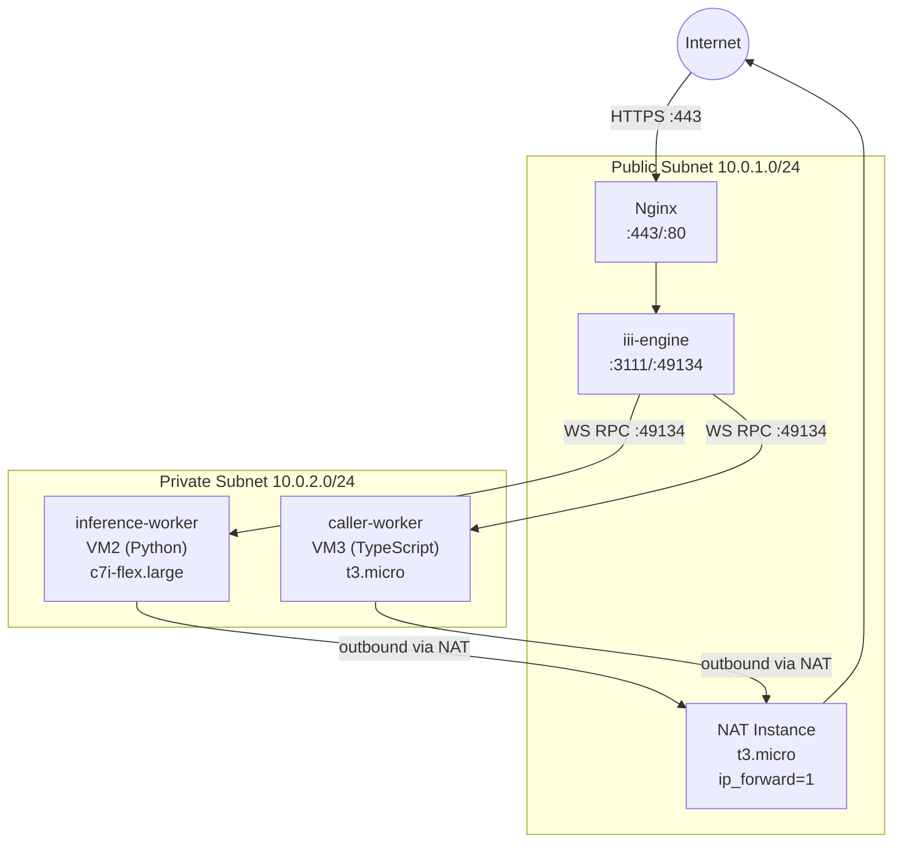
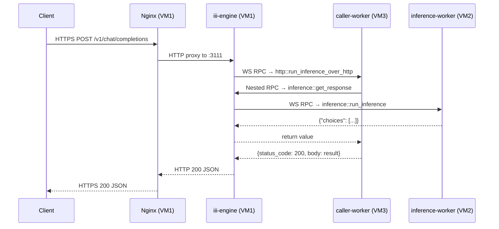

# Architecture Diagrams

This directory contains architecture diagrams for the distributed inference platform.

---

## Diagrams Overview

### 1. VPC Network Topology


```
┌──────────────────────────────────────────────────────────────────────────────┐
│                        AWS VPC — 10.0.0.0/16                                 │
│                                                                              │
│  ┌──────────────────────────────────────────────────────────────────────┐   │
│  │                     Public Subnet — 10.0.1.0/24                      │   │
│  │                                                                      │   │
│  │   ┌────────────────────────────────────┐   ┌──────────────────────┐  │   │
│  │   │   VM1 — Engine Gateway (t3.micro)  │   │  VM4 — NAT Instance  │  │   │
│  │   │   ● Elastic Public IP              │   │  ● Elastic Public IP  │  │   │
│  │   │   ● Nginx  :443 → :3111           │   │  ● ip_forward = 1     │  │   │
│  │   │   ● iii-engine :3111 (loopback)   │   │  ● iptables MASQUERADE│  │   │
│  │   │   ● WS listener :49134            │   │  ● src/dst check off  │  │   │
│  │   └──────────────┬─────────────────┬──┘   └──────────┬───────────┘  │   │
│  │                  │ WS :49134        │                 │ outbound     │   │
│  └──────────────────┼──────────────────┼─────────────────┼─────────────┘   │
│                     │                  │                 │                   │
│  ┌──────────────────┼──────────────────┼─────────────────┼─────────────┐   │
│  │          Private Subnet — 10.0.2.0/24                │              │   │
│  │                  │                  │                 │ (via NAT)    │   │
│  │   ┌──────────────▼──────┐   ┌───────▼───────────────┐│              │   │
│  │   │  VM2 — inference-   │   │  VM3 — caller-worker  ├┘              │   │
│  │   │  worker (c7i-flex)  │   │  (t3.micro)           │               │   │
│  │   │  ● No public IP     │   │  ● No public IP       │               │   │
│  │   │  ● Python + iii SDK │   │  ● TypeScript + iii   │               │   │
│  │   │  ● inference::*     │   │  ● http::* triggers   │               │   │
│  │   │  ● +8GB swap        │   │                       │               │   │
│  │   └─────────────────────┘   └───────────────────────┘               │   │
│  └─────────────────────────────────────────────────────────────────────┘   │
└──────────────────────────────────────────────────────────────────────────────┘
```

### 2. Request Flow Diagram

```
  Client (HTTPS POST /v1/chat/completions)
      │
      │  HTTPS :443
      ▼
  ┌─────────────────────────────────────────┐
  │  Nginx (VM1)                            │
  │  • TLS termination (TLS 1.2/1.3)       │
  │  • Rate limiting (10 req/s, burst 20)   │
  │  • Proxy to 127.0.0.1:3111             │
  └────────────────────┬────────────────────┘
                       │  HTTP (loopback)
                       ▼
  ┌─────────────────────────────────────────┐
  │  iii-engine (VM1, :3111)                │
  │  • HTTP trigger routing                 │
  │  • Lookup: /v1/chat/completions → WS   │
  └────────────────────┬────────────────────┘
                       │  WebSocket RPC (push to VM3's channel)
                       ▼
  ┌─────────────────────────────────────────┐
  │  caller-worker (VM3, TypeScript)        │
  │  • Receives: http::run_inference_over_http
  │  • Parses JSON body                     │
  │  • Calls: inference::get_response      │
  └────────────────────┬────────────────────┘
                       │  Nested RPC (back through engine)
                       ▼
  ┌─────────────────────────────────────────┐
  │  iii-engine (VM1, :49134)               │
  │  • Routes inference::run_inference → VM2│
  └────────────────────┬────────────────────┘
                       │  WebSocket RPC (push to VM2's channel)
                       ▼
  ┌─────────────────────────────────────────┐
  │  inference-worker (VM2, Python)         │
  │  • Receives: inference::run_inference   │
  │  • Runs inference                       │
  │  • Returns: {"choices": [...]}         │
  └────────────────────┬────────────────────┘
                       │  Return value (bubbles back up the chain)
                       ▼
  Client ◄─── JSON Response: {"choices":[{"message":{"role":"assistant",...}}]}
```

### 3. Security Boundary Diagram

```
  INTERNET
      │
      │  :443 HTTPS (allowed)
      │  :80  HTTP  (redirected to HTTPS)
      │
  ┌───▼──────────────────────────────────┐
  │  AWS Security Group: iii-engine-sg   │
  │  Inbound: :80, :443 from 0.0.0.0/0   │
  │  Inbound: :22 from admin-IP/32        │
  │  Inbound: :49134 from 10.0.2.0/24    │ ← workers only
  │                                       │
  │  VM1 (Engine + Nginx)                 │
  │  ● Elastic Public IP                  │
  │  ● Engine binds to 127.0.0.1:3111   │ ← loopback only
  └──────────────────┬────────────────────┘
                     │ private subnet
                     │ (10.0.2.0/24 CIDR)
  ┌──────────────────▼────────────────────┐
  │  AWS Security Group: iii-worker-sg    │
  │  Inbound: :22 from VM1-private-IP/32  │ ← bastion only
  │  NO HTTP, NO HTTPS, NO public ports   │
  │                                       │
  │  VM2 (Inference Worker)               │
  │  VM3 (Caller Worker)                  │
  │  ● NO public IP                       │
  │  ● Accept NO inbound connections     │ ← workers connect OUT
  └───────────────────────────────────────┘
```

### 4. Worker Registration Sequence

```
  inference-worker (VM2)        iii-engine (VM1)         caller-worker (VM3)

  boot: systemd starts
        │
        ├─── WS CONNECT ──────────────►│
        │                              │
        ├─── REGISTER: ───────────────►│
        │  inference::run_inference     │
        │                              │◄──── WS CONNECT ──────────────┤
        │                              │                               │
        │                              │◄──── REGISTER: ───────────────┤
        │                              │   inference::get_response       │
        │                              │   http::run_inference_over_http │
        │                              │   HTTP trigger: POST /v1/...    │
        │                              │                               │
        │                   Registry:                                  │
        │                   ├─ inference::run_inference → VM2 WS       │
        │                   ├─ inference::get_response  → VM3 WS       │
        │                   ├─ http::run_...over_http   → VM3 WS       │
        │                   └─ POST /v1/chat/... → http::run_...       │
```

---

## Mermaid Source Files

The diagrams above are rendered as ASCII art for maximum compatibility. For interactive/rendered versions:

### Network Topology (Mermaid)



### Request Lifecycle (Mermaid)


