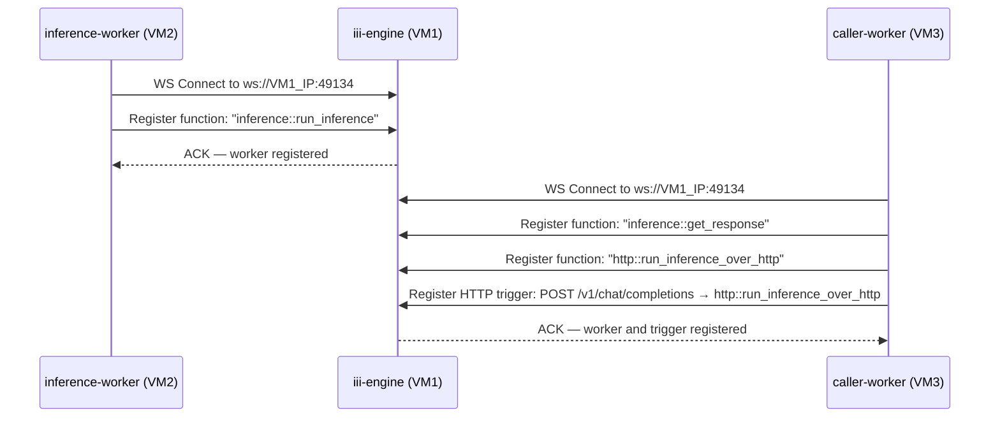

# System Architecture — Technical Deep Dive

This document provides a comprehensive technical breakdown of the distributed AI inference platform deployed on AWS. It covers the network topology, security model, RPC orchestration design, component interactions, request lifecycle, and failure recovery architecture.

---

## Table of Contents

1. [System Overview](#1-system-overview)
2. [Network Topology](#2-network-topology)
3. [Component Reference](#3-component-reference)
4. [NAT Instance Design](#4-nat-instance-design)
5. [RPC Mesh Architecture](#5-rpc-mesh-architecture)
6. [Nginx Reverse Proxy Design](#6-nginx-reverse-proxy-design)
7. [Worker Communication Model](#7-worker-communication-model)
8. [End-to-End Request Lifecycle](#8-end-to-end-request-lifecycle)
9. [Security Boundaries](#9-security-boundaries)
10. [Failure Recovery Flow](#10-failure-recovery-flow)
11. [Infrastructure as Code Overview](#11-infrastructure-as-code-overview)

---

## 1. System Overview


The platform distributes AI inference work across three purpose-built EC2 instances using the **iii-engine** as a central coordination runtime. Rather than exposing worker APIs directly to the network, all inter-service communication flows through a **WebSocket RPC mesh**: workers establish persistent outbound connections to the engine on startup and register callable functions, enabling the engine to act as a bidirectional message broker.

```
┌─────────────────────────────────────────────────────┐
│               System Component Map                   │
│                                                     │
│  Internet ──► VM1 (Engine + Nginx) ◄────────────┐  │
│                    │                             │  │
│                    │ WS RPC :49134               │  │
│                    ├─────────────────────────┐   │  │
│                    ▼                         ▼   │  │
│              VM2 (Python)            VM3 (TS)    │  │
│              inference-worker        caller-     │  │
│                                      worker      │  │
│                    │                    │        │  │
│                    └────────────────────┘        │  │
│                         NAT (VM4) ──────────────►│  │
│                         outbound internet        │  │
└─────────────────────────────────────────────────────┘
```

### Why This Architecture?

Traditional microservice architectures require each service to expose an HTTP listener and be reachable by its peers. This creates security challenges when services must run inside private subnets without public IPs.

The **iii-engine model inverts this**: workers connect *outbound* to the central engine on startup. The engine holds open WebSocket channels and routes function calls down those channels. Workers never need inbound firewall rules. This pattern naturally enforces private subnet isolation while enabling rich cross-language RPC.

---

## 2. Network Topology

### VPC Layout

```
AWS VPC: 10.0.0.0/16
│
├── Public Subnet: 10.0.1.0/24   (AZ: us-east-1a)
│   │
│   ├── VM1: iii-engine-gateway    [t3.micro]   ← Elastic Public IP
│   └── VM4: iii-nat-instance      [t3.micro]   ← Elastic Public IP
│
└── Private Subnet: 10.0.2.0/24  (AZ: us-east-1a)
    │
    ├── VM2: iii-inference-worker  [c7i-flex.large]  ← NO public IP
    └── VM3: iii-caller-worker     [t3.micro]         ← NO public IP
```

### Route Tables

**Public Route Table** (`iii-public-rt`):
| Destination | Target |
|---|---|
| `10.0.0.0/16` | local |
| `0.0.0.0/0` | Internet Gateway (`iii-igw`) |

**Private Route Table** (`iii-private-rt`):
| Destination | Target |
|---|---|
| `10.0.0.0/16` | local |
| `0.0.0.0/0` | NAT Instance ENI (VM4 primary network interface) |

### Internet Gateway

A single **Internet Gateway** (`iii-igw`) is attached to the VPC and referenced exclusively by the public route table. Private subnet traffic never touches the IGW directly; it egresses through the NAT instance instead.

---

## 3. Component Reference

### VM1 — Engine Gateway (Public Subnet)

| Property | Value |
|---|---|
| **Instance Type** | t3.micro (1 GiB RAM, 2 vCPU) |
| **Subnet** | Public (`10.0.1.0/24`) |
| **Public IP** | Elastic IP (static, public-facing) |
| **IAM Role** | `iii-engine-role` (SSM + CloudWatch) |
| **Services** | `nginx`, `iii-engine` |
| **Ports (inbound)** | 22 (SSH, admin IP only), 80 (HTTP→301), 443 (HTTPS, public), 49134 (WS, private subnet CIDR) |
| **Key Function** | TLS termination, rate limiting, RPC coordination, WebSocket registry |

### VM2 — Inference Worker (Private Subnet)

| Property | Value |
|---|---|
| **Instance Type** | c7i-flex.large (4 GiB RAM, 2 vCPU) |
| **Subnet** | Private (`10.0.2.0/24`) |
| **Public IP** | None |
| **IAM Role** | `iii-worker-role` (SSM) |
| **Services** | `inference-worker` |
| **Outbound Connection** | `ws://VM1_PRIVATE_IP:49134` |
| **Registered Function** | `inference::run_inference` |
| **Key Function** | Python-based inference, SLM model loading |

### VM3 — Caller Worker (Private Subnet)

| Property | Value |
|---|---|
| **Instance Type** | t3.micro (1 GiB RAM, 2 vCPU) |
| **Subnet** | Private (`10.0.2.0/24`) |
| **Public IP** | None |
| **IAM Role** | `iii-worker-role` (SSM) |
| **Services** | `caller-worker` |
| **Outbound Connection** | `ws://VM1_PRIVATE_IP:49134` |
| **Registered Functions** | `inference::get_response`, `http::run_inference_over_http` |
| **HTTP Trigger** | `POST /v1/chat/completions` |
| **Key Function** | Request validation, RPC orchestration |

### VM4 — NAT Instance (Public Subnet)

| Property | Value |
|---|---|
| **Instance Type** | t3.micro |
| **Subnet** | Public (`10.0.1.0/24`) |
| **Public IP** | Elastic IP |
| **Source/Dest Check** | **Disabled** (critical for NAT routing) |
| **Key Configuration** | `ip_forward=1` + `iptables MASQUERADE` |
| **Key Function** | Outbound internet access for private subnet VMs |

---

## 4. NAT Instance Design

### Why Not Use AWS NAT Gateway?

AWS Managed NAT Gateway costs approximately **$32/month** as a baseline, plus data transfer fees. For a development/demonstration project, this is prohibitive.

A self-managed **NAT Instance** on a `t3.micro` costs approximately **$3.80/month** — saving ~88% while providing equivalent outbound internet routing for the private subnet.

### How the NAT Instance Works

The NAT instance is configured via an EC2 `user_data` bootstrap script at launch:

```bash
# 1. Enable IP packet forwarding in the kernel
sysctl -w net.ipv4.ip_forward=1
echo "net.ipv4.ip_forward = 1" >> /etc/sysctl.conf

# 2. Add iptables MASQUERADE rule on the primary interface
DEFAULT_INTERFACE=$(ip route show | awk '/default/ {print $5}')
iptables -t nat -A POSTROUTING -o "$DEFAULT_INTERFACE" -j MASQUERADE

# 3. Persist rules across reboots via a boot service
iptables-save > /etc/iptables/rules.v4
# ... systemd nat-boot.service restores rules at reboot
```

**AWS Source/Dest Check** is disabled (`source_dest_check = false` in Terraform) — this is **critical**. By default, AWS rejects packets where the source or destination IP doesn't match the instance. Disabling this allows the NAT instance to route packets on behalf of private subnet instances.

### NAT Packet Flow

```
VM2 (10.0.2.x) sends packet to 8.8.8.8
    ↓
Private route table: 0.0.0.0/0 → NAT ENI
    ↓
NAT Instance receives packet (src: 10.0.2.x, dst: 8.8.8.8)
    ↓
iptables MASQUERADE: rewrites src to NAT's public IP
    ↓
Internet Gateway → Internet
    ↓
Response returns to NAT public IP
    ↓
iptables connection tracking: rewrites dst back to 10.0.2.x
    ↓
NAT forwards packet back to VM2
```

### NAT Limitation

The NAT instance is a **Single Point of Failure (SPOF)**. If VM4 crashes, all private workers lose outbound internet connectivity. In production, this would be replaced with **AWS Managed NAT Gateway** (multi-AZ capable) or a redundant NAT instance cluster behind a health-checked route replacement.

---

## 5. RPC Mesh Architecture

### iii-Engine Overview

The **iii-engine** is a lightweight coordination runtime that implements a WebSocket-based RPC protocol. It runs on VM1 and exposes two logical interfaces:

- **HTTP API** (`127.0.0.1:3111`) — receives trigger requests from Nginx and routes them to registered worker handlers
- **WebSocket RPC** (`0.0.0.0:49134`) — workers connect here to register functions and receive dispatched calls

### Worker Registration Flow



### Function Registry (Runtime State)

After both workers connect and register, the engine holds the following live routing table:

| Function ID | Handler | Transport |
|---|---|---|
| `inference::run_inference` | inference-worker (VM2) | Active WS channel |
| `inference::get_response` | caller-worker (VM3) | Active WS channel |
| `http::run_inference_over_http` | caller-worker (VM3) | Active WS channel |
| `POST /v1/chat/completions` | → `http::run_inference_over_http` | HTTP trigger |

### Caller-Worker Source (TypeScript)

```typescript
// worker.ts — caller-worker
const iii = registerWorker(process.env.III_URL ?? 'ws://localhost:49134');

// Registered as the RPC entry point for external callers
iii.registerFunction('inference::get_response', async (payload) => {
  // Trigger the Python worker via RPC through the engine
  const result = await iii.trigger({
    function_id: 'inference::run_inference',
    payload,
  });
  return { ...result, success: "Workers interoperating seamlessly." };
});

// HTTP trigger — maps POST /v1/chat/completions to this function
iii.registerFunction('http::run_inference_over_http', async (payload) => {
  // Parse request body, call inference::get_response
  const result = await iii.trigger({
    function_id: 'inference::get_response',
    payload: body,
  });
  return { status_code: 200, body: result, headers: { 'Content-Type': 'application/json' } };
});

iii.registerTrigger({
  type: 'http',
  function_id: 'http::run_inference_over_http',
  config: { api_path: '/v1/chat/completions', http_method: 'POST' },
});
```

### Inference-Worker Source (Python)

```python
# inference_worker.py
iii = register_worker(os.environ.get("III_URL", "ws://localhost:49134"))

def run_inference_handler(payload):
    messages = payload.get("messages", [])
    user_query = messages[-1].get("content", "hello")

    # Build a Gemma-formatted prompt, falling back to a manual template
    # when the GGUF tokenizer has no Hugging Face chat_template.
    prompt = build_gemma_prompt(messages, user_query)
    response_text = generate_with_gemma_gguf(prompt)
    return {
        "choices": [{"message": {"role": "assistant", "content": response_text}}],
        "text": response_text
    }

iii.register_function("inference::run_inference", run_inference_handler)
```

---

## 6. Nginx Reverse Proxy Design

Nginx runs on VM1 alongside the iii-engine. Its responsibilities:

1. **HTTP → HTTPS redirect** (port 80 → 301 to port 443)
2. **TLS termination** with a self-signed certificate (TLS 1.2/1.3 only, strong cipher suite)
3. **Rate limiting** per client IP (`10 req/s`, burst tolerance of 20 via `limit_req_zone`)
4. **Reverse proxy** to iii-engine on `127.0.0.1:3111`
5. **Static health check** response for `/health` without hitting the engine
6. **Security response headers** (`X-Frame-Options`, `X-Content-Type-Options`, CSP, XSS-Protection)
7. **Custom JSON error pages** for 502 Bad Gateway

### Key Nginx Configuration

```nginx
limit_req_zone $binary_remote_addr zone=api_limit:10m rate=10r/s;

server {
    listen 443 ssl;
    ssl_certificate     /etc/nginx/ssl/iii-api.crt;
    ssl_certificate_key /etc/nginx/ssl/iii-api.key;
    ssl_protocols       TLSv1.2 TLSv1.3;

    add_header X-Frame-Options       "DENY" always;
    add_header X-Content-Type-Options "nosniff" always;

    location /v1/ {
        limit_req zone=api_limit burst=20 nodelay;
        proxy_pass http://127.0.0.1:3111;
        proxy_read_timeout 120s;       # LLM generation can be slow
    }

    location /health {
        return 200 '{"status":"healthy","uptime":"active"}';
        add_header Content-Type application/json;
        access_log off;
    }
}
```

### Why Engine Binds to Loopback

The iii-engine binds its HTTP interface to `127.0.0.1:3111` rather than `0.0.0.0:3111`. This means **even if all security group rules were misconfigured**, the engine's HTTP API would still be unreachable from outside VM1. Only Nginx, running on the same host, can proxy requests to it. This is a **defense-in-depth** measure.

---

## 7. Worker Communication Model

```mermaid
graph LR
    A[Client HTTPS] --> B[Nginx :443 VM1]
    B --> C[iii-engine :3111 VM1]
    C -- "WS channel to VM3" --> D[caller-worker VM3]
    D -- "nested RPC via engine" --> E[iii-engine :49134 VM1]
    E -- "WS channel to VM2" --> F[inference-worker VM2]
    F --> G[SLM / Mock Response]
    G --> F
    F --> E
    E --> D
    D --> C
    C --> B
    B --> A
```



### Key Design Insight: Outbound-Only Worker Connections

Private subnet workers (VM2, VM3) never accept inbound connections from the engine. They initiate **outbound** WebSocket connections at startup. This means:

- Workers need **no inbound security group rules** from the engine
- Workers work correctly behind any NAT or firewall that allows outbound TCP
- The engine holds the active WS channels and "pushes" function call payloads down them
- Workers "pull" by processing messages that arrive on their open WebSocket

---

## 8. End-to-End Request Lifecycle

### Trace: `POST /v1/chat/completions`

```
Step 1: Client sends HTTPS request
──────────────────────────────────
POST https://<ENGINE_PUBLIC_IP>/v1/chat/completions
Content-Type: application/json
Body: {"messages": [{"role": "user", "content": "What is 2+2?"}]}

Step 2: Nginx processes request (VM1)
──────────────────────────────────
• Terminates TLS (decrypts request)
• Checks rate limit zone: client IP under 10 req/s? → Allow
• Matches location /v1/ → proxy_pass to http://127.0.0.1:3111
• Adds proxy headers (X-Real-IP, X-Forwarded-For, etc.)

Step 3: iii-engine receives HTTP request (VM1, :3111)
──────────────────────────────────
• Inspects path: /v1/chat/completions
• Looks up trigger registry: matches → http::run_inference_over_http
• Finds active WS channel to caller-worker (VM3)
• Serializes request payload as RPC message
• Sends RPC message DOWN the caller-worker's WebSocket

Step 4: caller-worker executes (VM3)
──────────────────────────────────
• Receives RPC message from engine over WS
• Executes http::run_inference_over_http handler
• Reads request body (JSON parse)
• Calls: iii.trigger({function_id: 'inference::get_response', payload: body})
• This sends a NEW RPC request UP the caller-worker's WS to the engine

Step 5: iii-engine routes nested RPC (VM1, :49134)
──────────────────────────────────
• Receives inference::get_response RPC from caller-worker
• caller-worker routes it again to inference::run_inference
• Engine finds active WS channel to inference-worker (VM2)
• Sends RPC payload DOWN the inference-worker's WebSocket

Step 6: inference-worker executes (VM2)
──────────────────────────────────
• Receives RPC message from engine over WS
• Executes run_inference_handler(payload)
• Extracts user query from messages array
• Generates response with the Gemma-3 270M GGUF model
• Returns {"choices": [...], "text": "..."} UP the WebSocket

Step 7-10: Return flow (all via WebSocket channels)
──────────────────────────────────
• inference-worker response → engine → caller-worker
• caller-worker wraps in HTTP response format: {status_code: 200, body: result}
• Engine delivers caller-worker's trigger response as HTTP 200 to Nginx
• Nginx returns JSON body to client

Total round-trip latency (real SLM response): ~2-30s after model warmup
```

---

## 9. Security Boundaries

### Security Group Matrix

| Source | VM1 Engine | VM2 Inference | VM3 Caller | VM4 NAT |
|---|---|---|---|---|
| **Internet** | :80, :443 ✅ | ❌ | ❌ | ❌ |
| **Admin IP** | :22 ✅ | ❌ | ❌ | :22 ✅ |
| **Private Subnet** | :49134 ✅ | ❌ | ❌ | all ✅ |
| **VM1 private IP** | — | :22 ✅ | :22 ✅ | — |
| **Egress** | All ✅ | All ✅ | All ✅ | All ✅ |

### Defense-in-Depth Layers

```
Layer 1: AWS VPC
  → Workers in private subnet — physically unreachable from internet

Layer 2: Security Groups
  → Workers accept SSH only from VM1's private IP
  → No inbound HTTP/HTTPS/WebSocket on workers

Layer 3: Application (WebSocket Direction)
  → Workers connect OUTBOUND — no listening ports required

Layer 4: Engine Binding
  → iii-engine HTTP (3111) binds to 127.0.0.1 — loopback only

Layer 5: Nginx
  → TLS termination, rate limiting, security headers
  → Client never touches engine directly

Layer 6: IAM
  → Separate roles per function (engine vs. worker)
  → SSM-only access pattern supported (no SSH keys needed in production)
```

### Network Security Diagram

```
                    INTERNET
                        │
              ┌─────────▼──────────┐
              │  AWS Internet GW   │
              └─────────┬──────────┘
                        │
              ┌─────────▼──────────┐  ← SG: allow :80, :443 from 0.0.0.0/0
              │     Nginx (VM1)    │  ← SG: allow :22 from admin IP
              │   iii-engine       │  ← SG: allow :49134 from 10.0.2.0/24 only
              └──┬──────────────┬──┘
                 │              │
          WS :49134         WS :49134
                 │              │
    ┌────────────▼──┐   ┌───────▼─────────┐
    │ inference-wkr │   │  caller-worker  │
    │ 10.0.2.x      │   │  10.0.2.x       │
    │               │   │                 │
    │ SG: SSH from  │   │ SG: SSH from    │
    │ VM1 only      │   │ VM1 only        │
    └───────────────┘   └─────────────────┘
```

---

## 10. Failure Recovery Flow

### Scenario A: Worker Process Crash

```
inference-worker process exits unexpectedly (OOM, unhandled exception)
    ↓
systemd detects process death
    ↓
systemd waits RestartSec=10s
    ↓
systemd restarts the process
    ↓
inference_worker.py starts, calls register_worker()
    ↓
Worker opens new WebSocket connection to iii-engine :49134
    ↓
Worker re-registers inference::run_inference
    ↓
System is healthy again — no manual intervention needed
```

### Scenario B: WebSocket Connection Lost (Network Blip)

```
WebSocket connection between caller-worker and engine drops
    ↓
iii SDK detects connection close event
    ↓
SDK enters exponential backoff retry loop:
    1s → 2s → 4s → 8s → ... → max 60s
    ↓
Connection re-established
    ↓
Worker re-registers functions automatically
    ↓
Requests resume routing normally
```

### Scenario C: NAT Instance Failure

```
VM4 (NAT instance) crashes or becomes unreachable
    ↓
Private subnet loses outbound internet connectivity
    ↓
Existing WS connections (already established) remain alive
    ↓
Workers can continue processing in-flight requests
    ↓
Workers cannot pull new packages or reach external APIs
    ↓
Recovery: Restart VM4 via AWS Console / CLI
         OR run: make destroy && make deploy
```

### Scenario D: iii-Engine Crash

```
iii-engine process on VM1 exits
    ↓
systemd restarts iii-engine (Restart=always, RestartSec=5s)
    ↓
Engine comes back up, WS registry is cleared
    ↓
Workers detect disconnection, enter reconnect loops
    ↓
Workers reconnect and re-register all functions
    ↓
Nginx continues serving requests (engine recovers mid-flight)
    ↓
System fully recovered typically within 10-30 seconds
```

---

## 11. Infrastructure as Code Overview

### Terraform Resource Graph

```
tls_private_key.pk
    └── aws_key_pair.deployer
    └── local_file.ssh_key (terraform/iii-key.pem)

aws_vpc.main
    ├── aws_subnet.public
    │   ├── aws_internet_gateway.igw
    │   ├── aws_route_table.public (→ IGW)
    │   └── aws_route_table_association.public
    │
    └── aws_subnet.private
        ├── aws_route_table.private (→ NAT ENI)
        └── aws_route_table_association.private

aws_security_group.engine   → aws_instance.engine
aws_security_group.nat      → aws_instance.nat (source_dest_check=false)
aws_security_group.caller   → aws_instance.caller
aws_security_group.inference → aws_instance.inference

aws_iam_role.engine
    └── aws_iam_role_policy_attachment.engine_ssm
    └── aws_iam_role_policy_attachment.engine_cw
    └── aws_iam_instance_profile.engine → aws_instance.engine

aws_iam_role.worker
    └── aws_iam_role_policy_attachment.worker_ssm
    └── aws_iam_instance_profile.worker → aws_instance.caller
                                        → aws_instance.inference
```

### Ansible Role Execution Order

```
Play 1: all hosts      → role: common
    • Update apt, install system packages
    • Create 'iii' user and group
    • Configure 8 GiB swap file (critical for inference on constrained memory)
    • Set up /opt/iii directory structure

Play 2: engine_gateway → role: nginx
    • Install nginx
    • Generate self-signed SSL certificate via openssl
    • Deploy /etc/nginx/sites-available/iii-api.conf
    • Enable site, reload nginx

Play 2: engine_gateway → role: engine
    • Install Node.js via NodeSource repository
    • Install iii-engine globally via npm
    • Deploy quickstart/config.yaml to /opt/iii/quickstart/
    • Install and enable iii-engine.service

Play 3: inference_worker → role: inference-worker
    • Install Python 3 + pip
    • Create virtualenv at /opt/iii/workers/inference-worker/venv/
    • pip install iii SDK
    • Deploy inference_worker.py
    • Template inference-worker.service with ENGINE_PRIVATE_IP
    • Enable and start inference-worker.service

Play 4: caller_worker → role: caller-worker
    • Install Node.js via NodeSource
    • Deploy caller-worker source to /opt/iii/workers/caller-worker/
    • npm install
    • Template caller-worker.service with ENGINE_PRIVATE_IP
    • Enable and start caller-worker.service
```

---

*For security details, see [SECURITY.md](./SECURITY.md). For deployment instructions, see [DEPLOYMENT.md](./DEPLOYMENT.md).*
